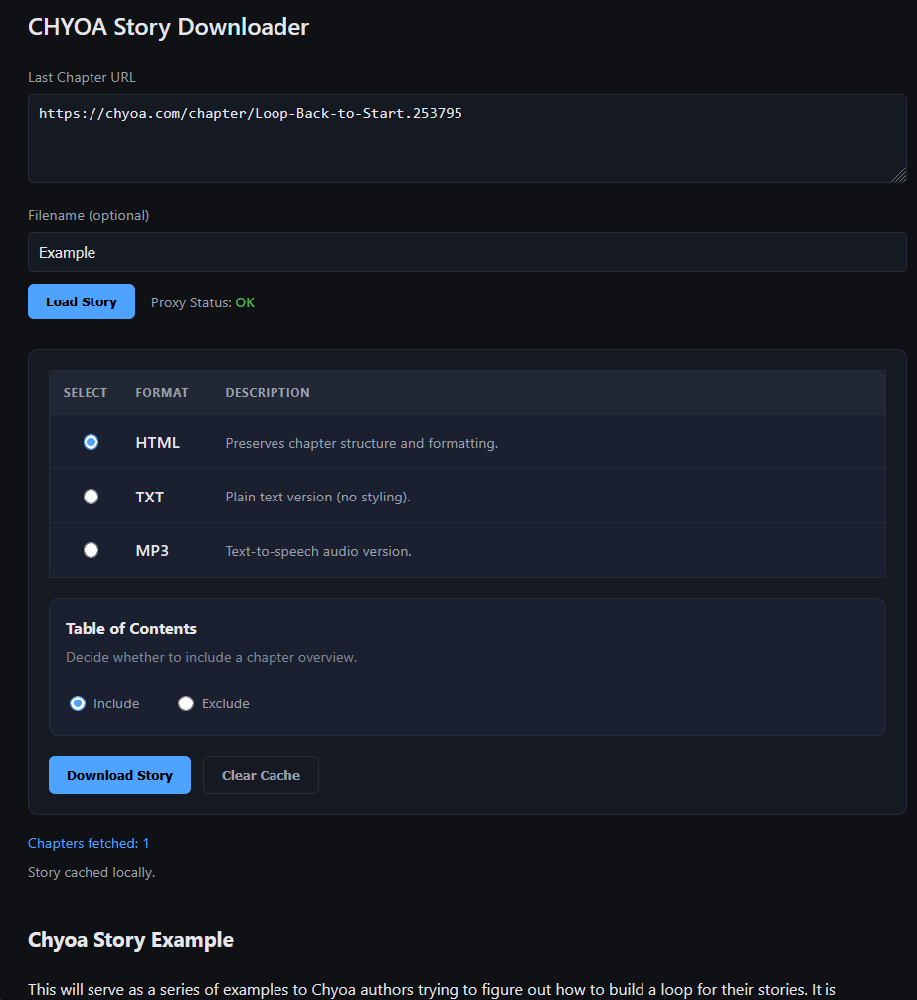

# CHYOA Story Downloader

## Overview
`CHYOA Story Downloader` is a Docker-based application that can be deployed using Portainer for easy management and orchestration.
The tool can be used to download a Chyoa.com story, by pasting the URL of the last story branch into the intended input box.

**Currently avialable download formats are:**
- HTML
- TXT
- MP3 (Experimental)

## Screenshot
** **

** **
## Features
- `Story preview` before download
- Optional `Table of Contents` checkbox
- `Cache` funktion
- `Proxiy` rotation and health check
- Easy `Docker` deployment with Portainer (automatic restart policy, configurable port mapping, lightweight containerized solution

## Portainer Integration Guide

### Step 1: Build the docker image
 - Open the environment in which you wish to create your stack
 - Select `Build a new image` under your `Images` tab
 - Incert under `Names` the name you wish to call your image (in my case `chyoadownloaderimage`)
 - Select `URL` and incert the following link `https://github.com/jdpagm03-tech/chyoadownloader.git`
 - Select `Build the image`

### Step 2: Docker Compose Configuration
- Select `Add Stack` under the `Stacks` tab
- `Name` your Stack something like `CHYOA Story Downloader`
- add the `Docker Compose` service with the following configuration:
** **
```yaml
services:
  chyoadownloader:
    image: chyoadownloaderimage:latest
    ports:
      - "1101:1102"  # Port mapping can be adjusted here
    restart: unless-stopped
```

**Port Mapping Explanation:**
- `1101` - External port (access from host machine)
- `1102` - Internal container port
** **
- `Deploy` the stack

### Step 3: Access the Application
Once deployed, access ChyoaDownloader at:
```
http://localhost:1101
```


## Notes
- MP3 download funktion is still experimental
- the availability of proxies may impact the performance
** **
Works as described (March 14, 2026)
